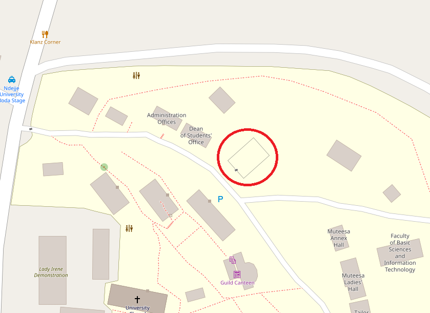

# WeatherStation
The Water Research & Development Centre is implementing an automatic weather station at Lady Irene Campus, Ndejje University, Luweero, Uganda.

## Location
The station is located at [coordinates 0.60897/32.48098](https://www.openstreetmap.org/#map=19/0.60897/32.48098)

## Measurements 
Temperature\
Relative humidity\
Atmospheric pressure\
Wind speed\
Wind direction\
Rain fall

## Data Access
Current readings will be accessible at the [centre's website](https://nduwrdc.org) and the [University's website](https://www.ndejjeuniversity.ac.ug/).

# Sensor data readout and storage 
The DHT11 sensor connects to the Atmega328 through pin 2 and the temperature and humidity.ino file picks the reading into the system. A database is created on the server to handle all the values as they come in. Template files to handle the values on the server are currently hosted on the [Safe Bugs Domain](https://www.safebugsug.com/weather-chart.php).
## [Station Data](https://www.safebugsug.com/weather-data.php)

## [Chart](https://www.safebugsug.com/weather-chart.php)

# Components used
## Microcontroller
|Component|Usage|Source|Cost|
| --- | --- | --- | --- |
|1x Atmega328 | microcontroller | |
|1x DHT11 | Temperature and Relative Humidity Sensor Module for arduino | |
|1x Arduino UNO R3 ATMEGA328P | Micro controller board | |
|1x ENC28J60 | Ethernet LAN Network Module For Arduino | |
|1x DS3231N AT24C32 | IIC RTC Module Precision Clock Module for Arduino (no battery) | |
|1x Soldering Iron Stand |  | |
|1x BMP280 | Pressure Sensor Module High Precision Atmospheric Replace BMP180 | |
|1x CRYSTAL OSCILLATORS 16MHZ |  | |
|1x Ceramic capacitor 22pf |  | |
|1x lm2596 | Step down buck converter |  | |	
|1x 28 PIN DIP IC Socket Adapter |  | |
|1x 12V 2A UK Plug Adapter |  | |
|1x Header Pins | Male Straight Double Row (Breakaway) connector  | |	
|1x DC Jack female DC-005	|	| | KES 20.00 |
|40x Male-Female Jumper wires/connector | | | 
|1x ATMEGA328P-PU | Microcontrolle​r With ARDUINO UNO R3 Bootloader | |

## Weather Station Set
|Component|Usage|Source|Cost|
| --- | --- | --- | ---: |
|[Weather meter kit](https://www.sparkfun.com/products/15901) | [Tipping-rain-gauge](https://bc-robotics.com/shop/tipping-rain-gauge/)   [Wind Vane – Analog Direction Senso](https://bc-robotics.com/shop/wind-vane-analog-direction-sensor-bc-robotics/)  [Anemometer – Wind Speed Sensor](https://bc-robotics.com/shop/anemometer-wind-speed-sensor-2/) | UG Unlocked | 473,000 UGX |
|[Weather shield](https://www.sparkfun.com/products/13674) | Connects sensors to microcontoller | UG Unlocked | 147,000 UGX |

[Weather Meter Hookup Guide](https://learn.sparkfun.com/tutorials/weather-meter-hookup-guide)\
[Weather Shield Hookup Guide](https://learn.sparkfun.com/tutorials/photon-weather-shield-hookup-guide-v11)

    
